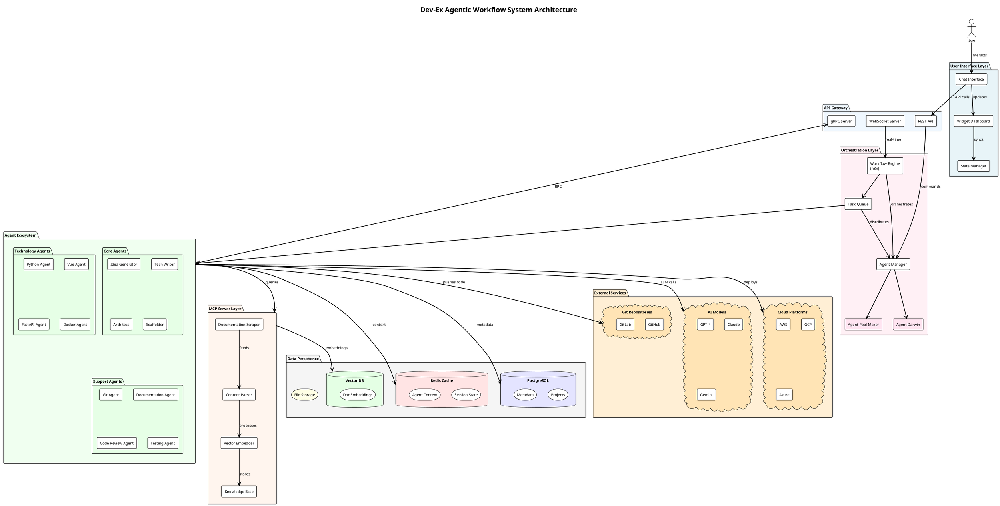
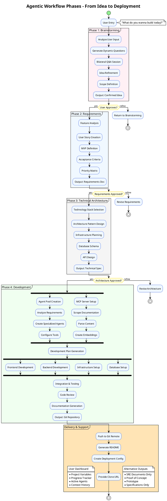
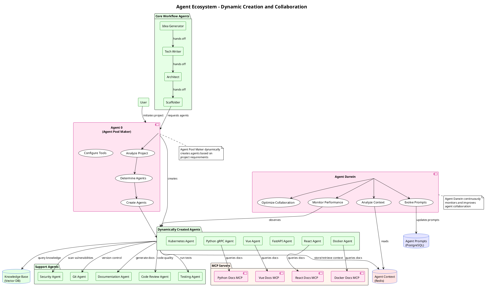
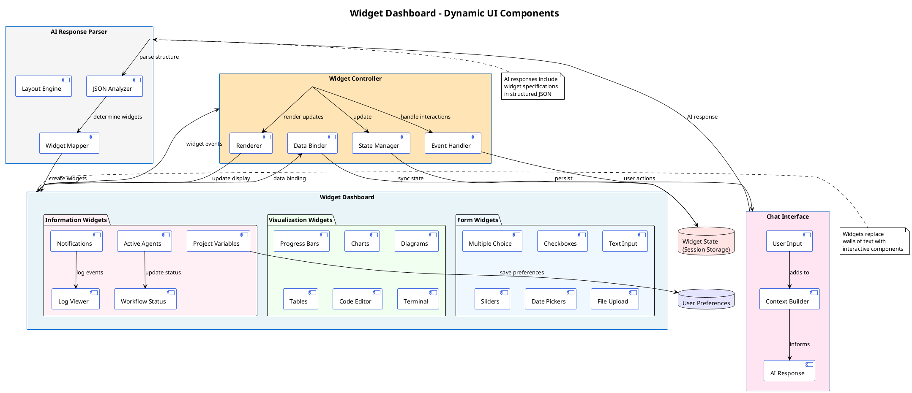
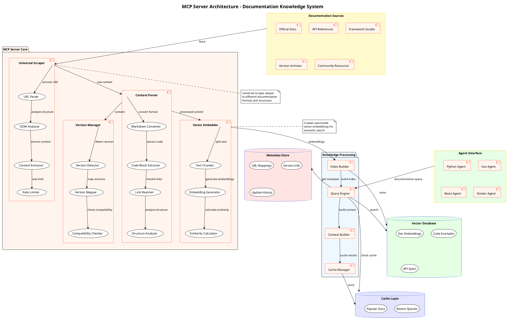
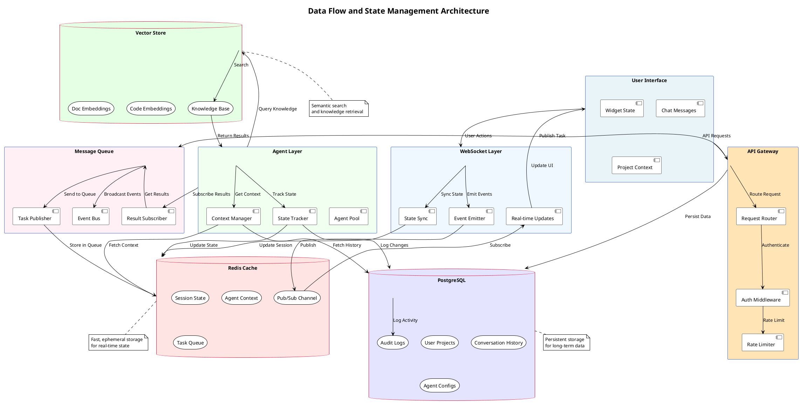

# Dev-Ex Agentic Workflow System - Diagrams

## 1. High-Level System Architecture



## 2. Workflow Phases and Transitions



## 3. Agent Ecosystem and Interactions



## 4. Widget and UI Component System



## 5. MCP Server Architecture for Documentation Scraping



## 6. Development Phase Agent Orchestration

```plantuml
@startuml
!theme plain
title Development Phase - Agent Orchestration Flow

skinparam sequenceMessageAlign center
skinparam sequenceArrowThickness 2
skinparam participantBackgroundColor #E6FFE6
skinparam participantBorderColor #228B22
skinparam actorBackgroundColor #FFE4F1
skinparam actorBorderColor #C71585

actor User
participant "Agent Pool Maker" as APM
participant "Agent Darwin" as Darwin
participant "Frontend Agent" as Frontend
participant "Backend Agent" as Backend
participant "Database Agent" as Database
participant "Git Agent" as Git
participant "Testing Agent" as Test
participant "Review Agent" as Review

== Initialization Phase ==

User -> APM : Project Requirements
activate APM
APM -> APM : Analyze Requirements
APM -> APM : Determine Agent Needs

APM -> Frontend : Create & Configure
activate Frontend
APM -> Backend : Create & Configure
activate Backend
APM -> Database : Create & Configure
activate Database
APM -> Git : Create & Configure
activate Git

APM --> User : Agents Ready
deactivate APM

== Development Phase ==

par Frontend Development
  Frontend -> Frontend : Scaffold UI Components
  Frontend -> Frontend : Implement Features
  Frontend -> Frontend : Style Application
and Backend Development
  Backend -> Backend : Create API Structure
  Backend -> Backend : Implement Business Logic
  Backend -> Backend : Setup Middleware
and Database Development
  Database -> Database : Design Schema
  Database -> Database : Create Migrations
  Database -> Database : Seed Data
end par

== Integration Phase ==

Frontend -> Backend : API Integration
Backend -> Database : Data Layer Integration

Frontend -> Git : Commit Frontend Code
Backend -> Git : Commit Backend Code
Database -> Git : Commit Schema

== Testing Phase ==

Git -> Test : Trigger Tests
activate Test
Test -> Test : Unit Tests
Test -> Test : Integration Tests
Test -> Test : E2E Tests
Test --> Git : Test Results
deactivate Test

== Review Phase ==

Git -> Review : Code Review Request
activate Review
Review -> Review : Analyze Code Quality
Review -> Review : Check Best Practices
Review -> Review : Security Scan
Review --> Git : Review Report
deactivate Review

== Evolution Phase ==

Darwin -> Frontend : Monitor Performance
Darwin -> Backend : Monitor Performance
Darwin -> Database : Monitor Performance

Darwin -> Darwin : Analyze Metrics
Darwin -> Darwin : Generate Improvements

Darwin -> Frontend : Update Prompts
Darwin -> Backend : Update Prompts
Darwin -> Database : Update Prompts

== Delivery Phase ==

Git -> Git : Create Release
Git -> User : Repository URL
User -> User : Clone & Run

deactivate Frontend
deactivate Backend
deactivate Database
deactivate Git

@enduml
```

## 7. Data Flow and State Management



## 8. Security and Governance Architecture

```plantuml
@startuml
!theme plain
title Security and Governance Architecture

skinparam componentBackgroundColor #FFE4E1
skinparam componentBorderColor #DC143C
skinparam rectangleBackgroundColor #FFF0F0
skinparam rectangleBorderColor #8B0000

package "Security Layer" #FFE4E1 {
  
  component "Authentication" as auth {
    usecase "JWT Tokens" as jwt
    usecase "OAuth 2.0" as oauth
    usecase "API Keys" as apikeys
    usecase "Session Management" as session
  }
  
  component "Authorization" as authz {
    usecase "RBAC" as rbac
    usecase "Project Permissions" as perms
    usecase "Resource Access" as resource
    usecase "Agent Permissions" as agentperms
  }
  
  component "Rate Limiting" as ratelimit {
    usecase "Request Throttling" as throttle
    usecase "Execution Limiter" as execlimit
    usecase "Circuit Breaker" as circuit
    usecase "Cost Controls" as cost
  }
  
  component "Data Protection" as protect {
    usecase "Encryption at Rest" as encrypt
    usecase "TLS in Transit" as tls
    usecase "Secret Management" as secrets
    usecase "PII Masking" as pii
  }
}

package "Governance" #FFF0F0 {
  
  component "Audit Trail" as audit {
    usecase "Action Logging" as actions
    usecase "Change Tracking" as changes
    usecase "Access Logs" as access
    usecase "Decision History" as decisions
  }
  
  component "Compliance" as compliance {
    usecase "Data Retention" as retention
    usecase "GDPR Controls" as gdpr
    usecase "Export Controls" as export
    usecase "Deletion Rights" as deletion
  }
  
  component "Monitoring" as monitor {
    usecase "Security Events" as events
    usecase "Anomaly Detection" as anomaly
    usecase "Performance Metrics" as metrics
    usecase "Cost Tracking" as costs
  }
}

rectangle "Enforcement Points" as enforce #FFFFE0 {
  component "API Gateway" as gateway
  component "Agent Runtime" as runtime
  component "Data Access" as dataaccess
  component "External Services" as external
}

database "Security Store" as secstore #FFE4E4 {
  storage "User Credentials" as creds
  storage "Permissions" as permdb
  storage "Audit Logs" as auditdb
  storage "Security Events" as eventdb
}

auth --> jwt : generate
jwt --> session : manage
oauth --> apikeys : alternative

authz --> rbac : check roles
rbac --> perms : verify
perms --> resource : control
resource --> agentperms : delegate

ratelimit --> throttle : apply
throttle --> execlimit : limit
execlimit --> circuit : protect
circuit --> cost : control

protect --> encrypt : secure
encrypt --> tls : transmit
tls --> secrets : manage
secrets --> pii : mask

audit --> actions : log
actions --> changes : track
changes --> access : record
access --> decisions : history

compliance --> retention : enforce
retention --> gdpr : comply
gdpr --> export : control
export --> deletion : enable

monitor --> events : detect
events --> anomaly : analyze
anomaly --> metrics : measure
metrics --> costs : track

gateway --> auth : authenticate
gateway --> authz : authorize
gateway --> ratelimit : limit

runtime --> authz : check
runtime --> protect : secure
runtime --> audit : log

dataaccess --> protect : encrypt
dataaccess --> audit : track

external --> ratelimit : control
external --> audit : log

secstore --> creds : store
secstore --> permdb : manage
secstore --> auditdb : persist
secstore --> eventdb : record

note bottom of auth
  Multi-factor authentication
  and secure session management
end note

note bottom of ratelimit
  Prevents resource exhaustion
  and controls costs
end note

@enduml
```



## Summary

These PlantUML diagrams provide a comprehensive visualization of the Dev-Ex agentic workflow system, covering:

1. **System Architecture**: The overall component structure and relationships
2. **Workflow Phases**: The progression from idea to deployment with checkpoints
3. **Agent Ecosystem**: Dynamic agent creation and collaboration patterns
4. **Widget System**: Interactive UI components replacing text-heavy interfaces
5. **MCP Architecture**: Documentation scraping and knowledge management
6. **Development Orchestration**: How agents coordinate during development
7. **Data Flow**: State management and data persistence patterns
8. **Security & Governance**: Authentication, authorization, and compliance controls

Each diagram illustrates different aspects of the system, showing how autonomous agents collaborate to transform user ideas into fully functional applications while maintaining flexibility for various output types and user control throughout the process.