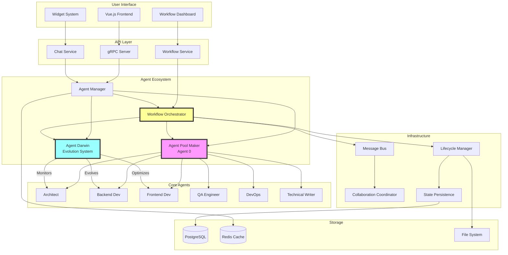
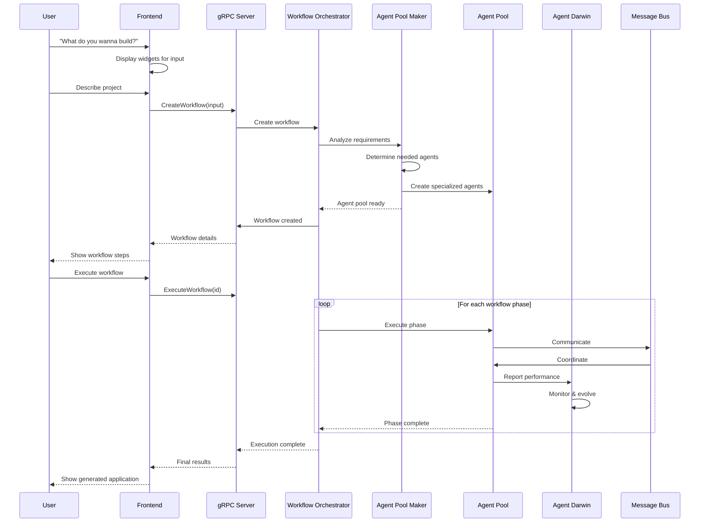
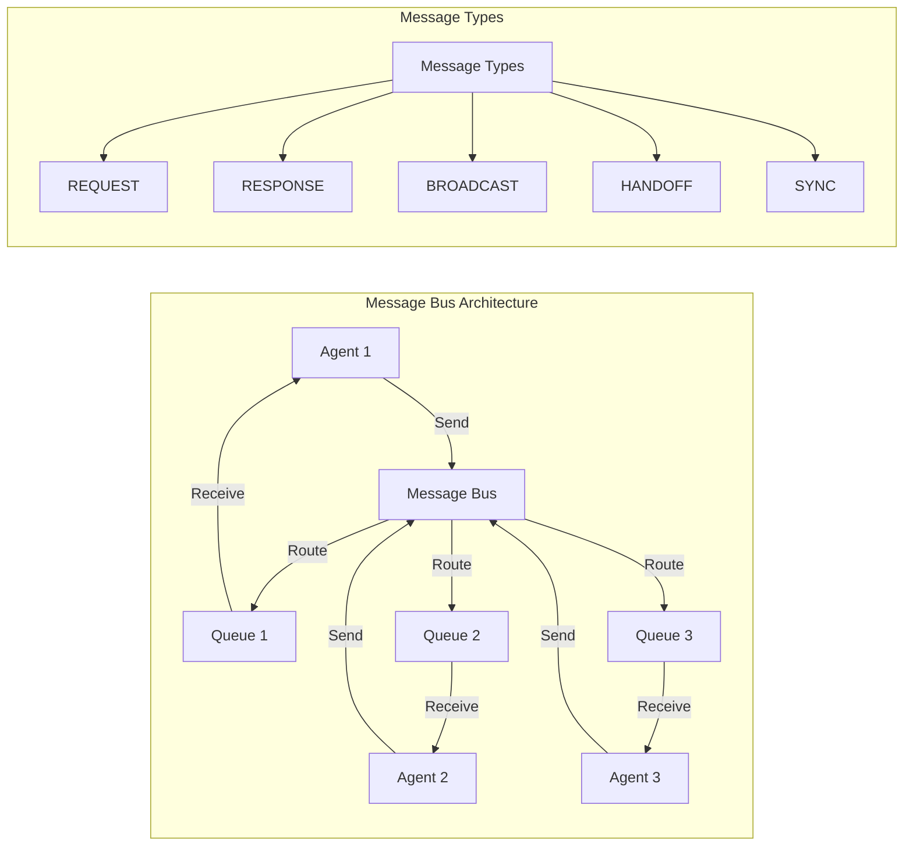
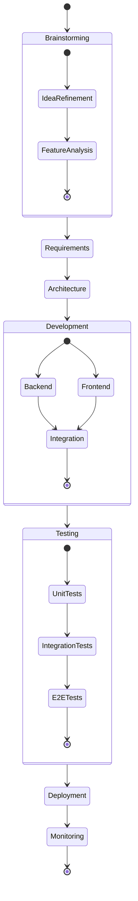
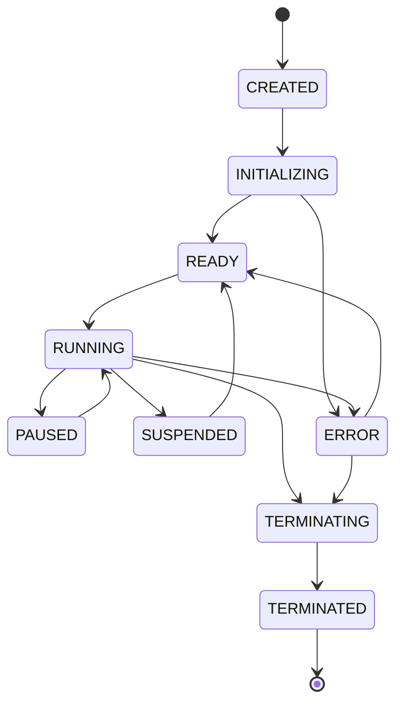
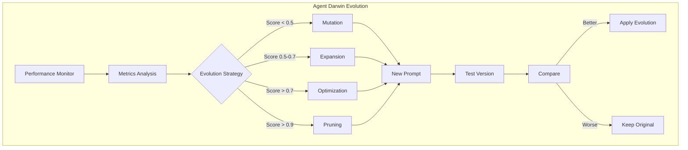
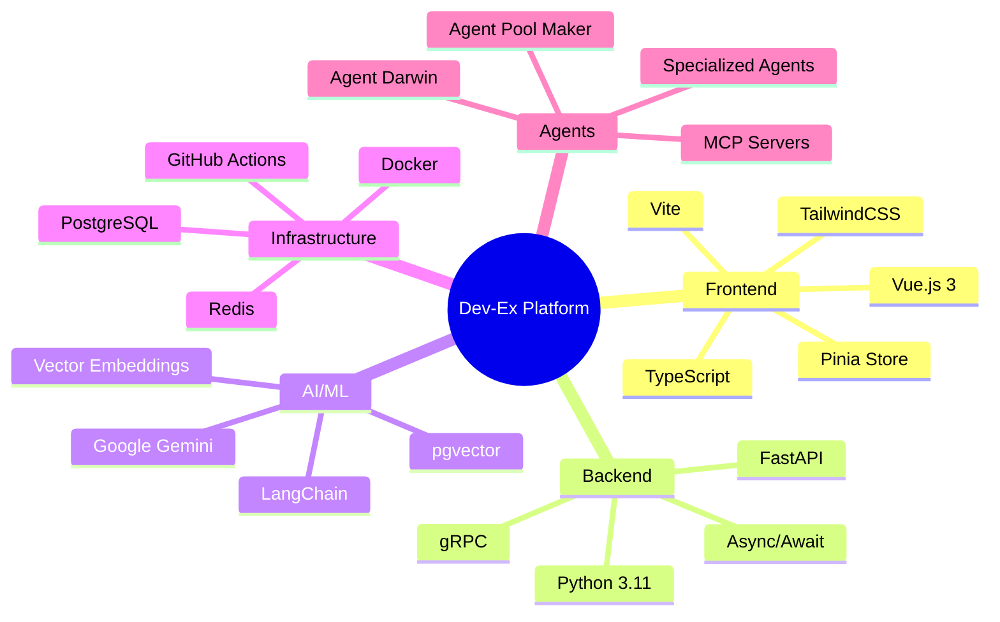
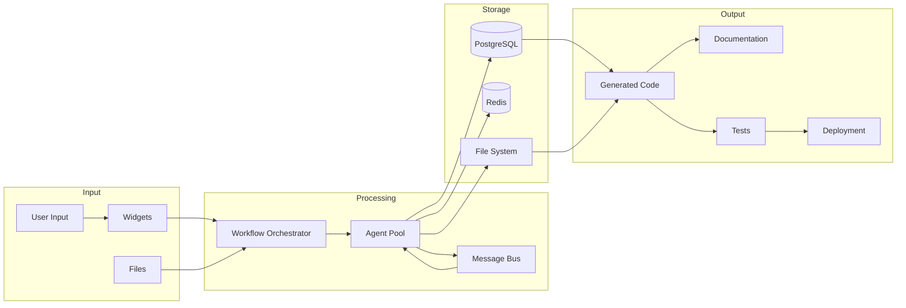
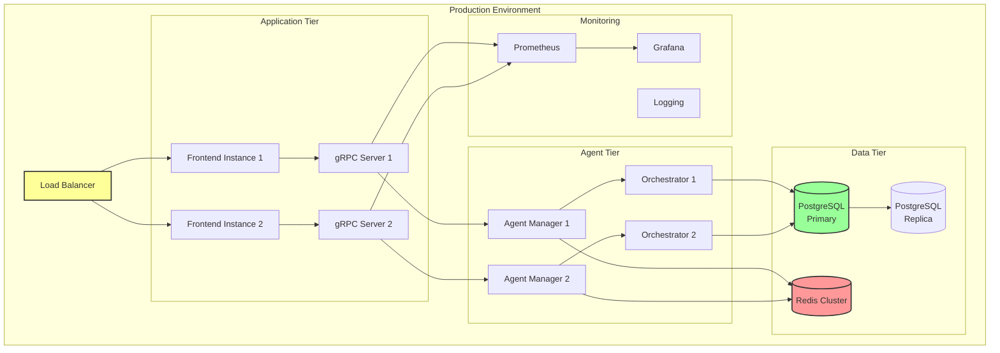
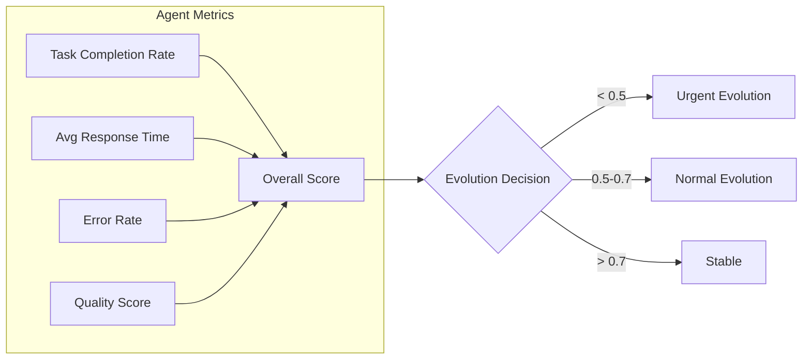

# Agentic Workflow System - Complete Architecture

## System Overview

The Dev-Ex Agentic Workflow System transforms ideas into fully functional applications through autonomous AI agents working in coordinated workflows.

## Architecture Diagram

## Workflow Execution Flow

## Agent Communication Protocol

## Workflow Phases

## Agent Lifecycle States

## Performance Evolution System

## Technology Stack

## Data Flow

## Deployment Architecture

## Key Features

### 1. Dynamic Agent Creation

- **Agent Pool Maker (Agent 0)** analyzes project requirements
- Creates specialized agents based on technology stack
- Assigns responsibilities and dependencies

### 2. Intelligent Orchestration

- **Workflow Orchestrator** coordinates multi-phase execution
- Manages agent lifecycle and state
- Handles parallel and sequential execution

### 3. Real-time Evolution

- **Agent Darwin** monitors performance metrics
- Applies evolutionary strategies for improvement
- Maintains prompt versioning and rollback

### 4. Inter-agent Communication

- **Message Bus** enables agent collaboration
- Supports multiple message patterns
- Provides collaboration coordination

### 5. State Management

- **Lifecycle Manager** tracks agent states
- Persistent storage with checkpoints
- Recovery and rollback capabilities

## Supported Project Types

| Project Type | Agents Used | Estimated Time | Complexity |
|-------------|------------|----------------|------------|
| Web Application | Architect, Backend, Frontend, QA, DevOps | 2-4 weeks | High |
| API Service | Architect, Backend, Database, QA | 1-2 weeks | Medium |
| Documentation | Architect, Technical Writer | 3-5 days | Low |
| Mobile App | Architect, Mobile Dev, Backend, QA | 3-5 weeks | High |
| Data Pipeline | Architect, Data Engineer, QA | 1-2 weeks | Medium |

## Performance Metrics

## Future Enhancements

1. **MCP Server Integration** - Connect to external documentation sources
2. **Workflow Templates** - Pre-built workflows for common projects
3. **Multi-tenant Support** - Isolated environments for teams
4. **Advanced Analytics** - Detailed performance insights
5. **Plugin System** - Extensible agent capabilities
6. **Cloud Deployment** - Scalable cloud infrastructure

## Conclusion

The Dev-Ex Agentic Workflow System represents a paradigm shift in software development, where AI agents collaborate to transform ideas into reality. Through dynamic agent creation, intelligent orchestration, and continuous evolution, the system delivers complete applications from simple text descriptions.

**"What do you wanna build today?"** - The question that starts the journey from idea to deployment.