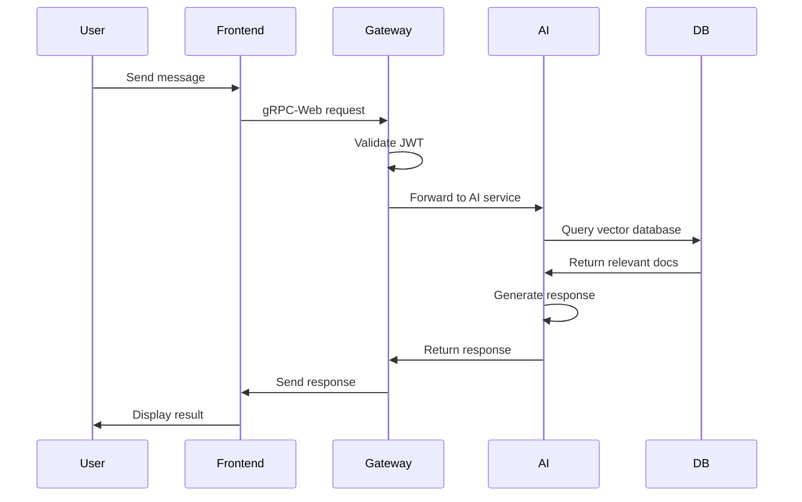

# Dev-Ex Platform Architecture Overview

## Executive Summary

Dev-Ex is a dual-purpose system that combines an AI-driven autonomous development platform with a modular documentation Q&A application. The architecture emphasizes modularity, extensibility, and user control through a "human-in-the-loop" approach.

## System Components

### High-Level Architecture

```
┌─────────────────────────────────────────────────────────────┐
│                  Workflow Orchestration Layer                 │
│                    (Custom Workflow Engine)                   │
├─────────────────────────────────────────────────────────────┤
│                      Agent Ecosystem                          │
│  ┌──────────┐  ┌──────────┐  ┌──────────┐  ┌──────────┐   │
│  │  Agent   │  │  Agent   │  │   Idea   │  │Technical │   │
│  │Pool Maker│→ │  Darwin  │→ │Generator │→ │  Writer  │   │
│  └──────────┘  └──────────┘  └──────────┘  └──────────┘   │
├─────────────────────────────────────────────────────────────┤
│                    Support Infrastructure                     │
│  ┌──────────┐  ┌──────────┐  ┌──────────┐  ┌──────────┐   │
│  │  gRPC    │  │  Redis   │  │  Vector  │  │Workflow  │   │
│  │ Services │  │  Cache   │  │Database  │  │  State   │   │
│  └──────────┘  └──────────┘  └──────────┘  └──────────┘   │
└─────────────────────────────────────────────────────────────┘
```

## Core Philosophy

The platform operates on three fundamental principles:

### 1. Modularity
- Each agent is a discrete, replaceable unit with defined inputs/outputs
- Components communicate through standardized interfaces (gRPC/Protocol Buffers)
- Services can be independently scaled and deployed

### 2. User Sovereignty
- All major decisions require explicit user approval
- Human-in-the-loop design ensures control over critical operations
- Transparent decision-making process with clear approval checkpoints

### 3. Self-Improvement
- The platform can generate and refine its own agent specifications
- Meta-agent architecture (Agent 0) creates prompts for new agents
- Continuous learning through feedback loops

## Application Architecture

### Documentation Q&A System

```
┌─────────────────────────────────────────────────────────────┐
│                        Frontend (Vue.js)                      │
│  ┌──────────┐  ┌──────────┐  ┌──────────┐  ┌──────────┐   │
│  │   Chat   │  │  Widget  │  │ Command  │  │   Dock   │   │
│  │Interface │  │  System  │  │  Center  │  │Component │   │
│  └──────────┘  └──────────┘  └──────────┘  └──────────┘   │
├─────────────────────────────────────────────────────────────┤
│                    gRPC-Web Proxy Layer                       │
├─────────────────────────────────────────────────────────────┤
│                   API Gateway (Node.js)                       │
│  ┌──────────┐  ┌──────────┐  ┌──────────┐  ┌──────────┐   │
│  │   Auth   │  │  Rate    │  │ Request  │  │  Session │   │
│  │ Service  │  │ Limiter  │  │  Router  │  │  Manager │   │
│  └──────────┘  └──────────┘  └──────────┘  └──────────┘   │
├─────────────────────────────────────────────────────────────┤
│                    gRPC Internal Layer                        │
├─────────────────────────────────────────────────────────────┤
│                   AI Services (Python)                        │
│  ┌──────────┐  ┌──────────┐  ┌──────────┐  ┌──────────┐   │
│  │   Agent  │  │  Gemini  │  │  Vector  │  │Connector │   │
│  │ Manager  │  │  Client  │  │  Search  │  │  Engine  │   │
│  └──────────┘  └──────────┘  └──────────┘  └──────────┘   │
├─────────────────────────────────────────────────────────────┤
│                      Data Layer                               │
│  ┌──────────┐  ┌──────────┐  ┌──────────┐  ┌──────────┐   │
│  │PostgreSQL│  │ pgvector │  │  Redis   │  │   S3     │   │
│  │    DB    │  │Extension │  │  Cache   │  │ Storage  │   │
│  └──────────┘  └──────────┘  └──────────┘  └──────────┘   │
└─────────────────────────────────────────────────────────────┘
```

## Communication Patterns

### Inter-Service Communication

1. **Frontend ↔ API Gateway**
   - Protocol: gRPC-Web over HTTP/1.1
   - Format: Protocol Buffers
   - Authentication: JWT tokens

2. **API Gateway ↔ AI Services**
   - Protocol: Native gRPC
   - Format: Protocol Buffers
   - Internal network only

3. **AI Services ↔ Data Layer**
   - PostgreSQL: asyncpg driver
   - Redis: async Redis client
   - S3: AWS SDK

### Message Flow



## Scalability Considerations

### Horizontal Scaling
- Stateless services (API Gateway, AI Services) can be replicated
- Load balancing through Kubernetes services
- Database read replicas for query distribution

### Vertical Scaling
- AI Services can be allocated more resources for model processing
- Vector database optimizations for large-scale similarity search
- Redis cluster for distributed caching

### Performance Optimization
- Multi-layer caching strategy (local, Redis, CDN)
- Connection pooling for database access
- Asynchronous processing for long-running operations

## Security Architecture

### Authentication & Authorization
- JWT-based authentication with refresh tokens
- Role-based access control (RBAC)
- API key management for external services

### Data Protection
- TLS encryption for all external communication
- Encrypted storage for sensitive data
- Input validation and sanitization

### Rate Limiting
- Per-user rate limits
- Tiered limits based on subscription level
- DDoS protection at gateway level

## Deployment Architecture

### Container Strategy
- Docker containers for all services
- Multi-stage builds for optimized images
- Health checks and readiness probes

### Orchestration
- Kubernetes for production deployment
- Docker Compose for development
- n8n for workflow orchestration

### Infrastructure as Code
- Kubernetes manifests for deployment
- Terraform for cloud infrastructure
- GitHub Actions for CI/CD

## Monitoring & Observability

### Metrics Collection
- Prometheus for metrics aggregation
- Service-specific metrics endpoints
- Custom business metrics

### Logging
- Structured logging with correlation IDs
- Centralized log aggregation
- Log levels based on environment

### Tracing
- OpenTelemetry for distributed tracing
- Request flow visualization
- Performance bottleneck identification

## Disaster Recovery

### Backup Strategy
- Automated daily database backups
- Vector embeddings backup to S3
- Configuration versioning in Git

### Recovery Procedures
- Database point-in-time recovery
- Service rollback capabilities
- Automated health checks and recovery

## Future Considerations

### Planned Enhancements
- Multi-region deployment for global availability
- Real-time collaboration features
- Advanced caching with edge computing

### Extensibility Points
- Plugin architecture for custom agents
- Webhook system for external integrations
- Custom connector development framework

## Related Documentation

- [Autonomous Platform Architecture](autonomous-platform.md)
- [Q&A Application Architecture](qa-application.md)
- [Agent Architecture](agents.md)
- [Data Architecture](data-architecture.md)