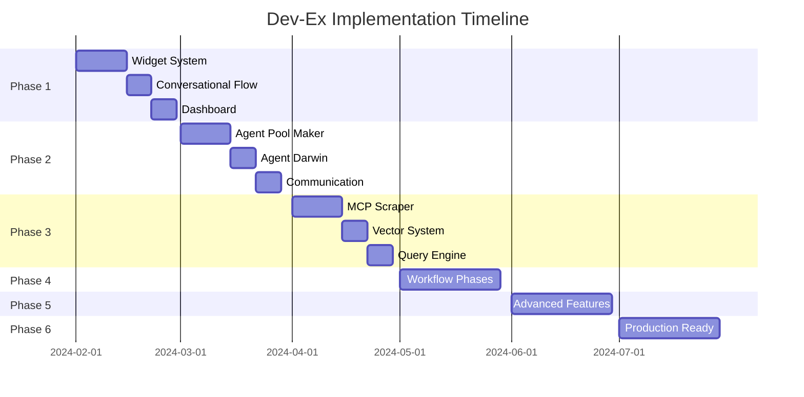

# Dev-Ex Implementation Roadmap

## Executive Summary

This roadmap outlines the phased implementation of the Dev-Ex agentic workflow platform, transforming the current foundation into a fully autonomous development system. The implementation is divided into 6 major phases over 24 weeks, with clear milestones and deliverables.

## Current State Assessment

### Existing Foundation
- ✅ Basic n8n workflow integration
- ✅ gRPC server infrastructure
- ✅ Redis session management
- ✅ PostgreSQL with vector embeddings
- ✅ Basic agent structure (Idea Generator, Tech Writer, Architect, Scaffolder)
- ✅ Docker containerization
- ✅ Basic frontend with chat interface
- ✅ File upload and management
- ✅ Code editor widget

### Gaps to Address
- ❌ Dynamic agent creation (Agent Pool Maker)
- ❌ Agent evolution system (Agent Darwin)
- ❌ MCP server infrastructure
- ❌ Advanced widget system
- ❌ Complete workflow phases
- ❌ Git integration
- ❌ Multi-agent orchestration
- ❌ Production-ready security

## Phase 1: Enhanced User Experience (Weeks 1-4)

### Goal
Transform the current chat interface into a dynamic, widget-based experience that guides users through the development process.

### Week 1-2: Dynamic Widget System
- **Implement Widget Framework**
  - Create base widget components
  - Build widget state management
  - Implement widget renderer
  - Add widget communication bus

- **Core Widgets**
  ```typescript
  - MultipleChoiceWidget
  - CheckboxWidget
  - SliderWidget
  - ProgressWidget
  - ChartWidget
  - TableWidget
  - DiagramWidget
  ```

### Week 3: Conversational Flow Enhancement
- **"What do you wanna build today?" Entry Point**
  - Implement initial prompt system
  - Create dynamic question generation
  - Build context accumulation logic
  - Add conversation branching

- **Response Parser**
  ```typescript
  interface AIResponse {
    widgets: Widget[];
    text?: string;
    questions?: Question[];
    nextPhase?: WorkflowPhase;
  }
  ```

### Week 4: Dashboard Implementation
- **Persistent Dashboard**
  - Project variables display
  - Progress tracking
  - Active agents monitor
  - Decision history
  - Context viewer

### Deliverables
- Fully functional widget system
- Enhanced chat interface
- User dashboard
- Dynamic question flow

## Phase 2: Agent Ecosystem Foundation (Weeks 5-8)

### Goal
Implement the core agent management system with Agent 0 (Pool Maker) and Agent Darwin.

### Week 5-6: Agent Pool Maker (Agent 0)
- **Core Implementation**
  ```typescript
  class AgentPoolMaker {
    analyzeRequirements(project: Project): RequiredAgents[]
    createAgent(spec: AgentSpec): Agent
    configureTools(agent: Agent, tools: Tool[]): void
    manageLifecycle(agents: Agent[]): void
  }
  ```

- **Agent Templates**
  - Define base agent templates
  - Create specialization system
  - Implement tool assignment
  - Build dependency resolver

### Week 7: Agent Darwin Implementation
- **Evolution System**
  ```typescript
  class AgentDarwin {
    monitorPerformance(agent: Agent): Metrics
    analyzeContext(context: Context): Insights
    generatePromptVariations(prompt: Prompt): Prompt[]
    optimizeAgent(agent: Agent, feedback: Feedback): void
  }
  ```

- **Learning Mechanisms**
  - Performance tracking
  - A/B testing framework
  - Prompt versioning
  - Feedback integration

### Week 8: Inter-Agent Communication
- **Protocol Implementation**
  - Message passing system
  - Handoff protocols
  - Conflict resolution
  - State synchronization

### Deliverables
- Agent Pool Maker functional
- Agent Darwin operational
- Basic agent communication
- Agent lifecycle management

## Phase 3: MCP Server Infrastructure (Weeks 9-12)

### Goal
Build the documentation scraping and knowledge management system.

### Week 9-10: Universal Documentation Scraper
- **Scraper Engine**
  ```typescript
  class UniversalScraper {
    detectStructure(url: string): DocStructure
    fetchContent(url: string): RawContent
    parseContent(content: RawContent): ParsedDoc
    handleVersions(versions: Version[]): void
  }
  ```

- **Initial Adapters**
  - Python documentation
  - JavaScript frameworks
  - Database documentation
  - Cloud provider docs

### Week 11: Vector Embedding System
- **Embedding Pipeline**
  - Content chunking algorithm
  - Embedding generation
  - Vector storage optimization
  - Similarity search implementation

### Week 12: Query Engine
- **Search Capabilities**
  - Semantic search
  - Keyword search
  - Hybrid search
  - Context-aware retrieval

### Deliverables
- MCP server operational
- Documentation scrapers for major technologies
- Vector search functional
- Knowledge base populated

## Phase 4: Complete Workflow Implementation (Weeks 13-16)

### Goal
Implement all workflow phases with proper transitions and checkpoints.

### Week 13: Brainstorming Phase
- **Enhanced Idea Generator**
  - Bilateral questioning system
  - Idea refinement logic
  - Scope definition tools
  - MVP boundary setting

### Week 14: Requirements & Technical Phases
- **Requirements Engineering**
  - User story generation
  - Acceptance criteria creation
  - Feature prioritization
  - Requirements validation

- **Technical Architecture**
  - Stack selection wizard
  - Architecture pattern selector
  - Infrastructure designer
  - Database schema generator

### Week 15-16: Development Phase
- **Autonomous Development**
  - Parallel agent execution
  - Code generation pipeline
  - Integration testing
  - Continuous deployment

- **Git Integration**
  ```typescript
  class GitAgent {
    initRepository(): Repository
    createBranch(name: string): Branch
    commit(changes: Changes, message: string): Commit
    createPullRequest(title: string, body: string): PR
    pushToRemote(remote: string): void
  }
  ```

### Deliverables
- All workflow phases operational
- Seamless phase transitions
- Git integration complete
- End-to-end project generation

## Phase 5: Advanced Features (Weeks 17-20)

### Goal
Add sophisticated capabilities and alternative output options.

### Week 17-18: Alternative Outputs
- **Flexible Deliverables**
  - SRE documentation only
  - Proof of concept generation
  - Prototype creation
  - Specification documents
  - Architecture diagrams only

### Week 19: Advanced Agent Capabilities
- **Specialized Agents**
  - Security scanning agent
  - Performance optimization agent
  - Documentation agent
  - Testing agent
  - DevOps agent

### Week 20: Monitoring & Analytics
- **Platform Analytics**
  ```typescript
  interface Analytics {
    projectMetrics: ProjectMetrics
    agentPerformance: AgentMetrics
    userSatisfaction: UserMetrics
    systemHealth: SystemMetrics
  }
  ```

### Deliverables
- Multiple output types supported
- Advanced agents operational
- Analytics dashboard
- Performance monitoring

## Phase 6: Production Readiness (Weeks 21-24)

### Goal
Prepare the platform for production deployment with enterprise features.

### Week 21-22: Security & Compliance
- **Security Implementation**
  - Authentication system enhancement
  - RBAC implementation
  - Secret management
  - Audit logging
  - Data encryption

- **Compliance Features**
  - GDPR compliance
  - Data retention policies
  - Export controls
  - Privacy controls

### Week 23: Performance Optimization
- **System Optimization**
  - Load balancing
  - Caching strategy
  - Database optimization
  - CDN integration
  - Resource pooling

- **Scalability Testing**
  - Load testing
  - Stress testing
  - Performance benchmarks
  - Bottleneck identification

### Week 24: Deployment & Documentation
- **Production Deployment**
  - Kubernetes deployment
  - CI/CD pipeline
  - Monitoring setup
  - Backup systems
  - Disaster recovery

- **Documentation**
  - User documentation
  - API documentation
  - Administrator guide
  - Developer documentation

### Deliverables
- Production-ready platform
- Complete documentation
- Security hardened
- Fully scalable system

## Technology Stack Evolution

### Current Stack Enhancement
```yaml
Frontend:
  - Add: Widget library, State management (Pinia/Zustand)
  - Enhance: WebSocket integration, Real-time updates

Backend:
  - Add: Agent orchestration layer, MCP servers
  - Enhance: gRPC services, Message queue

Infrastructure:
  - Add: Kubernetes, Prometheus, Grafana
  - Enhance: Redis clustering, PostgreSQL replication

AI/ML:
  - Add: Multiple LLM support, Embedding models
  - Enhance: Prompt management, Context handling
```

## Resource Requirements

### Team Composition
```yaml
Core Team:
  - Technical Lead: 1
  - Backend Engineers: 3
  - Frontend Engineers: 2
  - AI/ML Engineers: 2
  - DevOps Engineer: 1
  - QA Engineer: 1

Support:
  - Product Manager: 1
  - UX Designer: 1
  - Technical Writer: 1
```

### Infrastructure Costs (Monthly Estimate)
```yaml
Development Environment:
  - Cloud Infrastructure: $2,000
  - LLM API Costs: $3,000
  - Documentation APIs: $500
  - Monitoring Tools: $300

Production Environment:
  - Cloud Infrastructure: $5,000
  - LLM API Costs: $10,000
  - Documentation APIs: $1,000
  - Monitoring Tools: $500
  - CDN: $1,000
```

## Risk Mitigation

### Technical Risks
| Risk | Impact | Mitigation |
|------|---------|------------|
| LLM API Limits | High | Implement caching, multiple providers |
| Agent Coordination Complexity | High | Incremental rollout, extensive testing |
| Documentation Scraping Blocks | Medium | Rate limiting, caching, multiple sources |
| Performance Issues | Medium | Load testing, optimization phases |
| Security Vulnerabilities | High | Security audits, pen testing |

### Business Risks
| Risk | Impact | Mitigation |
|------|---------|------------|
| User Adoption | High | Beta program, user feedback loops |
| Cost Overruns | Medium | Phased deployment, usage monitoring |
| Competition | Medium | Unique features, rapid iteration |
| Scalability Issues | High | Cloud-native architecture, auto-scaling |

## Success Metrics

### Phase 1-2 (Foundation)
- Widget rendering < 100ms
- Question generation accuracy > 90%
- Agent creation success rate > 95%

### Phase 3-4 (Core Features)
- Documentation retrieval < 500ms
- Workflow completion rate > 80%
- Code generation accuracy > 85%

### Phase 5-6 (Production)
- System uptime > 99.9%
- User satisfaction > 4.5/5
- Project generation < 5 minutes
- Cost per project < $10

## Milestone Schedule



## Next Steps

### Immediate Actions (Week 1)
1. Set up development environment for widget system
2. Create widget component library structure
3. Design widget-agent communication protocol
4. Begin implementing base widget components
5. Set up monitoring and logging infrastructure

### Week 2-4 Priorities
1. Complete widget framework
2. Implement dynamic question generation
3. Create dashboard mockups
4. Begin Agent Pool Maker design
5. Set up testing infrastructure

## Conclusion

This roadmap provides a structured path to transform Dev-Ex from its current state into a fully autonomous development platform. The phased approach ensures continuous delivery of value while building toward the complete vision. Regular checkpoints and metrics will guide the implementation and allow for adjustments based on learnings and user feedback.